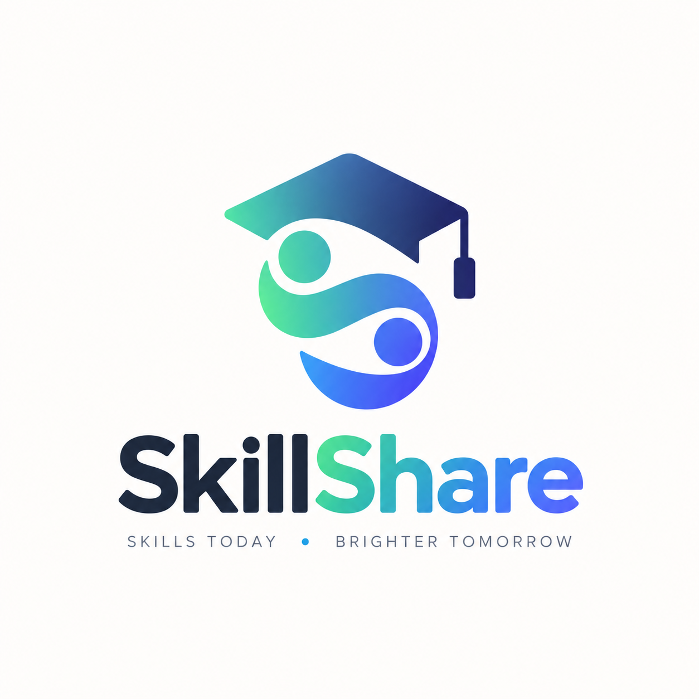
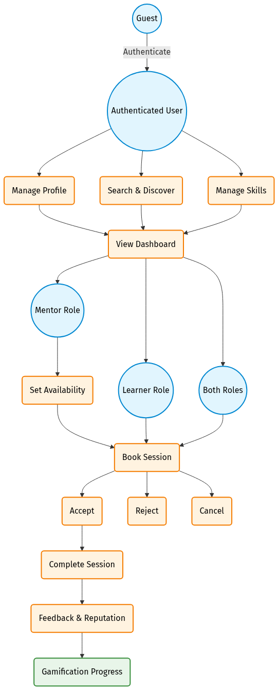
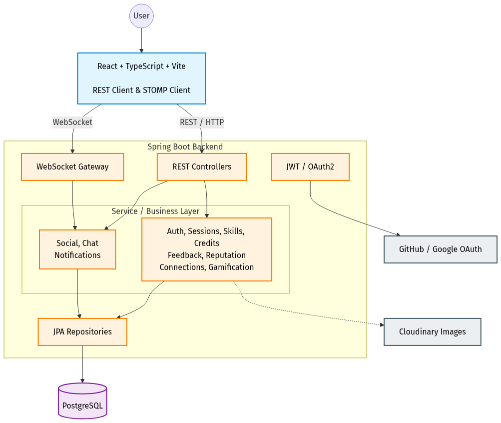

# SkillShare
### Peer-to-Peer Campus Skill-Sharing Platform



---

## Team
- **E/23/035**, Irusha Bandara, [email](mailto:e23035@eng.pdn.ac.lk)
- **E/23/104**, Poorna Gamage, [email](mailto:e23104@eng.pdn.ac.lk)
- **E/23/430**, Hiruni Weerasinghe, [email](mailto:e23430@eng.pdn.ac.lk)
- **E/23/317**, Sashika Rathnayake, [email](mailto:e23317@eng.pdn.ac.lk)

---

#### Table of Contents
1. [Project Overview](#project-overview)
2. [The Problem](#the-problem)
3. [Our Solution](#our-solution)
4. [Core Features](#core-features)
5. [How SkillShare Works](#how-skillshare-works)
6. [System Architecture](#system-architecture)
7. [Technology Stack](#technology-stack)
8. [Security and Trust](#security-and-trust)
9. [Testing and Verification](#testing-and-verification)
10. [Final Implementation Scope](#final-implementation-scope)
11. [Documentation](#documentation)
12. [Future Scope](#future-scope)
13. [Links](#links)

---

## Project Overview

**SkillShare** is an open, peer-to-peer skill-sharing platform tailored specifically for university students. Within any academic campus, students possess a rich, diverse range of talents—from programming and mathematics to design and language skills. However, these capabilities often remain hidden or siloed due to the lack of an organized exchange mechanism.

SkillShare bridges this gap by providing a structured, secure web application where university students can:
- Showcase skills they can teach and declare skills they wish to learn
- Discover peer mentors through skill-based search and filtering
- Publish and coordinate availability slots without timetable friction
- Book one-to-one learning sessions through a structured credit exchange
- Communicate in real time via an authenticated WebSocket chat system
- Complete sessions and exchange feedback, reputation, and experience points (XP)
- Maintain a safe, accountable community through reporting and moderation

By replacing ad-hoc messaging channels with a fair, decentralized credit-based economy, SkillShare enables students to trade knowledge as a collaborative campus resource.

---

## The Problem

University students routinely seek mentorship, exam assistance, or practical skill-building from peers. However, current informal channels—such as WhatsApp groups, word of mouth, or notice board announcements—present persistent challenges:

- **Discovery Bottlenecks:** Finding peers who excel at a specific skill or course topic is largely left to chance.
- **Scheduling Conflicts:** Coordinating mutually free times between demanding academic schedules requires frustrating back-and-forth negotiation.
- **Asymmetric Incentives:** In purely informal settings, knowledgeable students are frequently asked for help without compensation or recognition, leading to burnout.
- **Fragmented Tools:** Students must juggle multiple disconnected tools for finding contacts, scheduling, messaging, and sharing meeting links.
- **Lack of Accountability:** Informal agreements offer no verification, no reputation tracking, and no safety mechanism against no-shows or inappropriate behavior.

---

## Our Solution

SkillShare addresses these challenges by consolidating peer mentorship into an integrated, end-to-end workflow:

```
Student Registration & Profile Setup
               │
               ▼
   Declare Skills (TEACH / LEARN)
               │
               ▼
Discover Mentors via Search & Filters
               │
               ▼
 View Mentor Availability & Profile
               │
               ▼
Book 1-on-1 Session (10 Credits Reserved)
               │
               ▼
 Real-Time Chat Coordination (STOMP/WS)
               │
               ▼
      Attend & Complete Session
               │
               ▼
 Mutual Feedback, Credit Transfer & XP Growth
```

Rather than enforcing rigid multi-party matching cycles, SkillShare implements a decoupled **Credit Economy**:
- Every learning session carries a standard booking fee of **10 credits**.
- 10 credits are deducted/reserved from the learner when booking.
- Credits are refunded where the session lifecycle requires it (such as session rejection or cancellation).
- 10 credits are transferred to the mentor after successful completion.
- Students replenish their credits by offering skills and mentoring peers, creating a self-sustaining cycle of collaborative learning.

---

## Core Features

### 1. Authentication & Social Sign-In
- Secure local account registration and login with email and password.
- Stateless authentication using signed JSON Web Tokens (JWT).
- Social login integration via **GitHub OAuth2**.
- Automatic session hydration and protected client-side route guards.

### 2. User Profiles & Media Management
- Personalized student profiles displaying biography, skills, availability, and platform statistics.
- Secure profile picture uploads powered by **Cloudinary** cloud storage.
- Real-time display of credit balance, XP, level, and reputation rating.

### 3. Skill Management & Discovery
- Centralized skill catalog categorized by domain.
- Dual-role skill associations: students declare which skills they **TEACH** and which they want to **LEARN**.
- Live search and discovery for skills and mentors by name and skill, with reputation information available on mentor profiles.

### 4. Availability Management
- Any authenticated student can publish upcoming available time slots.
- Visual inspection of mentor availability directly on user profiles.
- Availability validation, ownership checks, and overlap/double-booking prevention.
- Booked-slot safeguards preventing deletion or invalid modifications.

### 5. One-to-One Learning Sessions
- Structured booking of available mentor time slots.
- Explicit session lifecycle: `PENDING` &rarr; `ACCEPTED` / `REJECTED` &rarr; `COMPLETED` or `CANCELLED`.
- Dual participant completion and cancellation workflows.

### 6. Campus Credit Economy
- Transparent credit balance tracking on student dashboards.
- Standard session fee of 10 credits deducted/reserved upon booking request.
- Credits are refunded according to the session rejection/cancellation rules.
- Direct credit payout to the mentor upon successful session completion.

### 7. Gamification & Reputation
- Experience Points (XP) awarded for active participation and mentoring.
- Dynamic leveling system reflecting user activity and engagement.
- Post-session feedback and reputation system building a public Trust/Reputation score.
- Campus-wide Leaderboard highlighting top-rated mentors and active learners.

### 8. Peer Connections Network
- Send, accept, or reject peer connection requests.
- Dedicated connections directory to easily reconnect with past mentors and study partners.

### 9. Real-Time Chat Infrastructure
- Full-duplex messaging powered by **STOMP over WebSockets**.
- Secure, authenticated WebSocket connections where JWT tokens are validated in the STOMP CONNECT frame via `WebSocketAuthInterceptor`.
- User-specific private message channels with message persistence in PostgreSQL.
- In-chat participant verification ensuring conversations remain private between session partners.

### 10. Notifications System
- In-app notification center for booking requests, status updates, and connection events.
- Real-time unread count indicators and mark-as-read management.

### 11. Platform Moderation & Administration
- Reporting framework allowing students to flag abusive behavior or fraudulent accounts.
- Dedicated Administrator Dashboard for reviewing open reports.
- Account freeze and unfreeze capabilities with immediate enforcement across both REST APIs and WebSocket endpoints.

---

## How SkillShare Works

```
 ┌──────────────┐         ┌──────────────┐         ┌──────────────┐
 │   1. Setup   │  ────►  │ 2. Discovery │  ────►  │  3. Booking  │
 │ Profile &    │         │ Search by    │         │ Select Slot &│
 │ Skills       │         │ Skill/Mentor │         │ Reserve 10 Cr│
 └──────────────┘         └──────────────┘         └──────────────┘
                                                          │
                                                          ▼
 ┌──────────────┐         ┌──────────────┐         ┌──────────────┐
 │5. Progression│  ◄────  │4. Completion │  ◄────  │ 4. Coordinate│
 │ Earn XP &    │         │ Payout Mentor│         │ Real-Time    │
 │ Ratings      │         │ & Feedback   │         │ WebSocket    │
 └──────────────┘         └──────────────┘         └──────────────┘
```

The system operation is summarized in the System Use Case Diagram below:



1. **Onboarding:** A student registers an account or signs in via GitHub, completes their bio, and adds their teaching and learning skills.
2. **Finding a Mentor:** The student searches the skill catalog, selects an available mentor, and reviews their profile, reputation, and published availability slots.
3. **Booking:** The learner chooses an available slot. The system validates slot availability and deducts/reserves 10 credits from the learner's balance.
4. **Coordination:** The mentor accepts the booking, triggering in-app notifications. The participants use built-in real-time chat to coordinate session logistics or share links.
5. **Completion & Review:** After meeting, the session is marked completed. The 10 credits are transferred to the mentor, participants exchange post-session feedback and reputation, and XP is credited to elevate leaderboard standings.

---

## System Architecture

SkillShare is built upon a modular, decoupled full-stack architecture that cleanly separates client presentation, business services, real-time messaging, and persistence.



### Architectural Layers
- **Presentation Layer (Frontend):** A responsive Single Page Application (SPA) built with React 18, TypeScript, and Vite. UI components are styled using Tailwind CSS and shadcn/ui design primitives, with TanStack React Query managing server state caching.
- **API & Messaging Gateway:** A layered Spring Boot REST API handles stateless HTTP requests, while a Spring WebSocket message broker routes STOMP frames over full-duplex WebSocket connections (`/ws`).
- **Application Services Layer:** Spring Boot services encapsulate domain logic, credit reservation and transfer operations, session lifecycle workflows, gamification algorithms, and moderation rules within strict `@Transactional` boundaries.
- **Security & Authorization Layer:** Spring Security filters enforce stateless JWT token validation on REST requests, while `WebSocketAuthInterceptor` validates JWT authentication in STOMP CONNECT frames, backed by role-based authorization (`ROLE_USER`, `ROLE_ADMIN`) and account freeze checks.
- **Persistence Layer:** PostgreSQL relational database accessed via Spring Data JPA / Hibernate, enforcing referential integrity across users, skills, sessions, credits, and chat messages.
- **External Integration Services:** Cloudinary is used for profile picture/media storage, and GitHub OAuth2 API for developer-friendly single sign-on.

---

## Technology Stack

| Domain | Technology / Library | Role / Purpose |
|---|---|---|
| **Frontend Framework** | React 18 & TypeScript | Component-based UI with compile-time type safety |
| **Frontend Tooling** | Vite 5 | Fast development server and optimized build pipeline |
| **Styling & Components** | Tailwind CSS & shadcn/ui | Modern, responsive, and accessible UI components |
| **Frontend State & Router** | React Router v6 & TanStack Query | Client-side routing and efficient server state caching |
| **Real-Time Client** | @stomp/stompjs | STOMP client over WebSockets for live chat |
| **Backend Framework** | Spring Boot 3.4 (Java 21) | Production-ready REST and messaging backend |
| **Security & Auth** | Spring Security & jjwt | JWT stateless authentication and role-based authorization |
| **ORM & Data Access** | Spring Data JPA / Hibernate | Object-relational mapping and transaction management |
| **Database** | PostgreSQL | Relational database with strict foreign key constraints |
| **Real-Time Messaging** | Spring WebSocket & STOMP | Broker for authenticated real-time chat channels |
| **Media Storage** | Cloudinary SDK | Cloud storage for user profile avatars |
| **Testing - Backend** | JUnit 5 & Mockito | Backend unit, integration, and service tests |
| **Testing - API** | Postman & Newman CLI | Automated end-to-end REST API contract verification |
| **Testing - Frontend** | Vitest & jsdom | Frontend unit and client behavior verification |

---

## Security and Trust

Security is engineered into every layer of the SkillShare platform:

- **Stateless JWT Authentication:** Credentials are exchangeable for signed JSON Web Tokens containing user claims. Tokens are verified on every incoming request.
- **Cryptographic Password Hashing:** Passwords are securely hashed using BCrypt before database persistence.
- **Role-Based Access Control (RBAC):** Administrative endpoints (`/api/admin/**`) are strictly guarded by `hasRole('ADMIN')`, separating administrative capabilities from standard student access.
- **Authenticated WebSockets:** `WebSocketAuthInterceptor` validates the JWT token provided in the STOMP `CONNECT` frame before allowing connection, ensuring unauthorized clients cannot subscribe to private message queues.
- **Account Freeze Enforcement:** Banned or frozen accounts are intercepted at the security filter layer, immediately terminating active sessions and blocking REST and WebSocket access.
- **Participant Access Verification:** Session completion, cancellation, and chat room access require explicit verification that the requesting user is an active participant in that session.
- **Input Validation & Sanitization:** Request DTOs are validated using Bean Validation (`@Valid`, `@NotNull`, `@Size`) with standardized `ApiError` responses, preventing invalid state transitions.

---

## Testing and Verification

Quality assurance was conducted across all layers of the SkillShare system using automated test suites, contract validation tools, and comprehensive manual functional scenarios.

### Verification Summary

| Verification Layer | Tooling / Harness | Scope / Target | Result | Status |
|---|---|---|---|---|
| **Backend Automated Tests** | JUnit 5 & Mockito | Services, security, controllers, business rules | **207 tests, 0 failures, 0 errors, 0 skipped** | **PASSED** |
| **API Automated Tests** | Postman & Newman CLI | End-to-end REST API contract validation | **18 requests, 30 assertions, 0 failures** | **PASSED** |
| **Frontend Automated Tests** | Vitest & jsdom | API client, token handling, error normalization | **10 tests across 2 suites, 0 failures** | **PASSED** |
| **Static Type Verification** | TypeScript (`tsc --noEmit`) | Entire frontend codebase type integrity | **0 compilation errors** | **PASSED** |
| **Manual Functional Verification** | End-to-End Test Matrix | 15 critical user journeys and admin flows | **15 representative manual functional scenarios — all passed** | **PASSED** |

---

### Automated Verification Evidence

#### 1. Backend Test Suite Execution (JUnit 5 / Maven)
The Spring Boot backend suite executes 207 automated unit and integration tests verifying credit deductions, session transitions, security filters, and gamification calculations:


#### 2. REST API Automated Contract Verification (Postman / Newman)
The Postman automated test collection executes 18 distinct API requests with 30 assertions, validating authentication flows, error formats, and CRUD operations:


#### 3. Frontend Unit & API Client Test Execution (Vitest)
The frontend test suite verifies `apiFetch()` behavior, token injection, error handling (401, 403, 409, 400 validation, 204 No Content), and network failures:


#### 4. TypeScript Static Type Compilation Check
Static type analysis ensures zero type mismatches or unhandled interface contracts across the entire frontend application:


---

### Product Showcase & Manual Functional Evidence

A representative set of manual functional scenarios was executed to verify visual and interactive behavior across major system workflows:

#### 1. Authenticated Student Dashboard
The student dashboard displays credit balances, current level, XP progression towards the next tier, active connections, and recent notifications:


#### 2. Skill Discovery & Mentor Search
Students can search the campus network by skill or user name, viewing matching peers with their expertise, profile details, and available reputation information:


#### 3. Profile Inspection & Availability Slots
Profiles showcase biography, teaching skills, learning goals, and published availability slots ready for booking:


#### 4. Credit Economy Lifecycle (Credit Reservation on Booking)
Before booking, the learner's balance is 175 credits. Upon requesting a session, 10 credits are deducted/reserved, adjusting the balance to 165 credits with the session in `PENDING` status:

| Before Booking (175 Credits) | After Booking (165 Credits & Pending Session) |
|---|---|
|  |  |

#### 5. Session Lifecycle Management
Students manage upcoming and past sessions with actions to accept, reject, cancel, or complete sessions according to their current state:


#### 6. Authenticated Real-Time Chat
Session participants communicate in real time through full-duplex STOMP/WebSocket channels to arrange meetings and exchange learning material:


#### 7. Feedback Submission & Gamification State
Upon session completion, participants exchange post-session feedback and reputation, triggering reputation updates, mentor credit distribution (+10 credits), and XP awards:


#### 8. Administrator Moderation Interface
Administrators review user reports, inspect infraction details, and freeze or unfreeze accounts to maintain campus safety:


---

## Final Implementation Scope

The following table details the scope of implemented functionality delivered in the final milestone release:

| Functional Area | Feature / Capability | Final Milestone 4 Status |
|---|---|---|
| **Authentication** | Local Registration & Login (JWT) | **Implemented** |
| **Authentication** | GitHub OAuth2 Social Login | **Implemented** |
| **Profiles** | Student Bios, Statistics & Level Display | **Implemented** |
| **Profiles** | Cloudinary Profile Picture Upload | **Implemented** |
| **Skills** | Central Catalog & Live Search | **Implemented** |
| **Skills** | User Skill Associations (TEACH / LEARN) | **Implemented** |
| **Availability** | Student Availability Slot Publishing & Removal | **Implemented** |
| **Sessions** | 1-on-1 Session Booking & Lifecycle Management | **Implemented** |
| **Economy** | 10-Credit Booking Reservation & Mentor Payout | **Implemented** |
| **Economy** | Automatic Refund on Rejection / Cancellation | **Implemented** |
| **Gamification** | Experience Points (XP) & Level Progression | **Implemented** |
| **Gamification** | Trust & Reputation Feedback System | **Implemented** |
| **Gamification** | Leaderboard & Trending Mentors | **Implemented** |
| **Social** | Peer Connection Requests & Management | **Implemented** |
| **Messaging** | Full-Duplex STOMP/WebSocket Private Chat | **Implemented** |
| **Notifications** | In-App Event & Session Notification Center | **Implemented** |
| **Moderation** | Student Reporting & Administrator Freeze Tools | **Implemented** |
| **Group Learning** | Multi-Student Group Study Sessions | *Future Scope* |
| **Course Pools** | University Course-Specific Learning Pools | *Future Scope* |
| **Calendar Sync** | Google Calendar 2-Way Synchronization | *Future Scope* |
| **Self-Service Auth** | Email Verification & Password Reset Flow | *Future Scope* |

---

## Documentation

The repository contains the following architecture, specification, and design documents:

- [Functional Requirements Specification](./functional-requirements.md)
- [Non-Functional Requirements Specification](./non-functional-requirements.md)
- [Database ER Model & Schema Documentation](./database-er-model.md)

*(Note: The User Manual, Developer Guide, and full Testing & Evidence report are not currently committed to the repository; their links are intentionally omitted to prevent dead links.)*

---

## Future Scope

While the core platform is fully functional and verified, the following enhancements represent promising future directions for campus deployment:

1. **Group Learning Sessions:** Expanding the 1-on-1 booking model into small collaborative study groups with shared credit contribution.
2. **University Course Pools:** Organizing peer mentors by specific academic course codes (e.g., CO2060, EE2080) for targeted exam preparation.
3. **External Calendar Synchronization:** Integrating Google Calendar and Outlook APIs to automatically sync booked sessions with academic schedules.
4. **Automated Email Verification & Recovery:** Introducing campus domain email verification (`@eng.pdn.ac.lk`) and self-service password reset flows.
5. **Mobile Push Notifications:** Implementing Web Push or mobile notifications to alert students immediately when booking requests arrive.

---

## Links

- [Project Repository](https://github.com/cepdnaclk/e23-co2060-SkillShare)
- [Project Page](https://projects.ce.pdn.ac.lk/co2060/e23/SkillShare/)
- [Department of Computer Engineering](https://www.ce.pdn.ac.lk/)
- [University of Peradeniya](https://eng.pdn.ac.lk/)

---

[//]: # (End of SkillShare Project Page)
