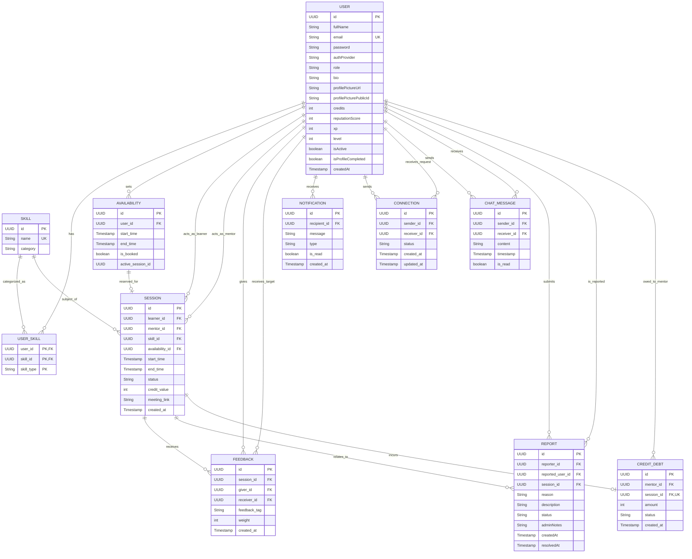

# SkillShare — Database ER Model

*Source of Truth: This entity-relationship model is based strictly on the CURRENT released JPA entity implementation in the `main` branch. It represents the database schema defined by the released application.*

## 1. Database Overview
The SkillShare database utilizes PostgreSQL as a robust relational data store. The schema is highly normalized and relies heavily on foreign key constraints, composite identities (where applicable), and UUID primary keys to support globally unique identifiers and scalable data management.

## 2. Entity List
1. `USER`
2. `SKILL`
3. `USER_SKILL`
4. `AVAILABILITY`
5. `SESSION`
6. `FEEDBACK`
7. `NOTIFICATION`
8. `CONNECTION`
9. `CHAT_MESSAGE`
10. `REPORT`
11. `CREDIT_DEBT`

## 3. Entity Attributes

- **USER**: 
  `id` (UUID), `fullName` (String), `email` (String, unique), `password` (String, nullable), `authProvider` (String), `role` (Enum), `bio` (String), `profilePictureUrl` (String), `profilePicturePublicId` (String), `credits` (Integer), `reputationScore` (Integer), `xp` (Integer), `level` (Integer), `isActive` (Boolean), `isProfileCompleted` (Boolean), `createdAt` (Timestamp)

- **SKILL**: 
  `id` (UUID), `name` (String, unique), `category` (String)

- **USER_SKILL**: 
  *Composite Key:* `user_id` (UUID), `skill_id` (UUID), `skill_type` (String: TEACH/LEARN)

- **AVAILABILITY**: 
  `id` (UUID), `start_time` (Timestamp), `end_time` (Timestamp), `is_booked` (Boolean), `active_session_id` (UUID)

- **SESSION**: 
  `id` (UUID), `availability_id` (UUID, FK), `start_time` (Timestamp), `end_time` (Timestamp), `status` (Enum), `credit_value` (Integer), `meeting_link` (String), `created_at` (Timestamp)

- **FEEDBACK**: 
  `id` (UUID), `feedback_tag` (String), `weight` (Integer), `created_at` (Timestamp)

- **NOTIFICATION**: 
  `id` (UUID), `message` (String), `type` (Enum), `is_read` (Boolean), `created_at` (Timestamp)

- **CONNECTION**: 
  `id` (UUID), `status` (Enum), `created_at` (Timestamp), `updated_at` (Timestamp)

- **CHAT_MESSAGE**: 
  `id` (UUID), `content` (String), `timestamp` (Timestamp), `is_read` (Boolean)

- **REPORT**: 
  `id` (UUID), `reason` (String), `description` (String), `status` (Enum), `adminNotes` (String), `createdAt` (Timestamp), `resolvedAt` (Timestamp)

- **CREDIT_DEBT**: 
  `id` (UUID), `amount` (Integer), `status` (Enum), `created_at` (Timestamp)

## 4. Primary Keys
All entities (except the associative `USER_SKILL` table) utilize auto-generated `UUID` fields as primary keys. `USER_SKILL` uses a composite primary key consisting of `user_id`, `skill_id`, and `skill_type`.

## 5. Foreign Keys
- `USER_SKILL` -> `USER` (`user_id`), `SKILL` (`skill_id`)
- `AVAILABILITY` -> `USER` (`user_id`)
- `SESSION` -> `USER` (`learner_id`, `mentor_id`), `SKILL` (`skill_id`), `AVAILABILITY` (`availability_id`)
- `FEEDBACK` -> `SESSION` (`session_id`), `USER` (`giver_id`, `receiver_id`)
- `NOTIFICATION` -> `USER` (`recipient_id`)
- `CONNECTION` -> `USER` (`sender_id`, `receiver_id`)
- `CHAT_MESSAGE` -> `USER` (`sender_id`, `receiver_id`)
- `REPORT` -> `USER` (`reporter_id`, `reported_user_id`), `SESSION` (`session_id`, nullable)
- `CREDIT_DEBT` -> `USER` (`mentor_id`), `SESSION` (`session_id`)

## 6. Relationships / Cardinality
- `USER` to `USER_SKILL`: 1-to-Many
- `SKILL` to `USER_SKILL`: 1-to-Many
- `USER` to `AVAILABILITY`: 1-to-Many
- `USER` to `SESSION` (Learner): 1-to-Many
- `USER` to `SESSION` (Mentor): 1-to-Many
- `SESSION` to `FEEDBACK`: 1-to-Many
- `USER` to `FEEDBACK` (Giver/Receiver): 1-to-Many
- `USER` to `CONNECTION` (Sender/Receiver): 1-to-Many
- `USER` to `CHAT_MESSAGE` (Sender/Receiver): 1-to-Many
- `USER` to `REPORT` (Reporter/Reported): 1-to-Many
- `SESSION` to `REPORT`: 1-to-Many
- `SESSION` to `CREDIT_DEBT`: 1-to-1 (Zero or One)

## 7. Important Constraints
- **Unique Constraints**: 
  - `USER.email`
  - `SKILL.name`
  - `CONNECTION` (`sender_id`, `receiver_id`) must be unique together.
  - `CREDIT_DEBT.session_id` must be unique.
- **Required Relations**:
  - `CREDIT_DEBT` absolutely requires a valid `mentor_id` association.

## 8. Mermaid ER Diagram

## 9. Relational Summary
The platform architecture strictly isolates users into individual 1-on-1 contextual mappings. A `SESSION` serves as the centralized junction point for transactional history, linking the Learner (`USER`), the Mentor (`USER`), the subject matter (`SKILL`), the temporal block (`AVAILABILITY`), and financial obligations (`CREDIT_DEBT`). Follow-up actions like `FEEDBACK` and `REPORT` firmly attach to this junction.

## 10. Design Notes
- Security fields (`password`, `authProvider`) allow flexibility between local login and OAuth2.
- The `USER_SKILL` table resolves a Many-to-Many relationship natively by using a composite entity to capture the `skill_type` context (whether the user teaches or learns the skill).
- The schema is designed for eventual soft-delete mechanics (e.g., `isActive` on `USER`).

## 11. Release Boundary
**Important Architectural Note:** This ER model accurately represents the Milestone 4 released system which exclusively focuses on **Individual peer-to-peer sessions**. Concepts such as `GroupSession`, `SessionParticipant`, `ParticipantStatus`, or `SessionType` are **NOT** part of the released `main` branch. They belong to an isolated future prototype and are explicitly omitted from this documentation.
